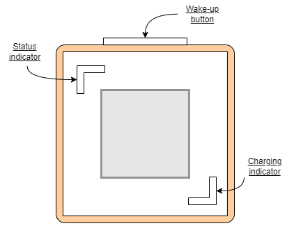
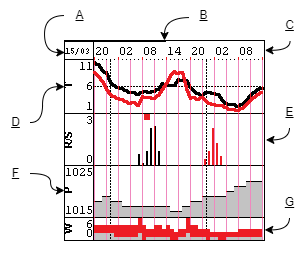

# User manual

## Front of the device

*   **Charging indicator:** Lights up when charging is in progress.
*   **Status indicator:**
    *   green - device is active
    *   blue - device in config mode
    *   red - error occurred
    *   yellow - indicates restart after hang-up condition
    *   cyan - factory reset
    *   white - critical error occurred. Manual restart needed
    *   **Wake-up button:** Wakes the device from sleep mode.

## Forecast display

Legend:

*   **A -** Forecast date.
*   **B -** Battery level.
*   **C -** Time line. The pink line separates the 3 hour segments. The dashed line separates the days.
*   **D -** Temperature in °C. The black line is the real temperature, the red line is the apparent temperature.
*   **E -** Rain (black) in mm and snowfall (red) in cm. The red square means a storm.
*   **F -** Atmospheric pressure in hPa.
*   **G -** Wind speed (grey) and gusts (red) in Beaufort scale.

| Beaufort number | Description | Wind speed |
|--|--|--|
| 0 | Calm | < 2 km/h, < 0.5 m/s |
| 1 | Light air | 2-5 km/h, 0.5-1.5 m/s |
| 2 | Light breeze | 6-11 km/h, 1.6-3.3 m/s |
| 3 | Gentle breeze | 12-19 km/h, 3.4-5.5 m/s |
| 4 | Moderate breeze | 20-28 km/h, 5.6-7.9 m/s |
| 5 | Fresh breeze | 29-38 km/h, 8.0-10.7 m/s |
| 6 | Strong breeze | 39-49 km/h, 10.8-13.8 m/s  |
| 7 | High wind | 50-61 km/h, 13.9-17.1 m/s |
| 8 | Gale | 62-74 km/h, 17.2-20.7 m/s |
| 9 | Strong gale | 75-88 km/h, 20.8-24.4 m/s |
| 10 | Storm | 89-102 km/h, 24.5-28.4 m/s |
| 11  | Violent storm | 103-117 km/h, 28.5-32.6 m/s |
| 12 | Hurricane-force | ≥ 118 km/h, ≥ 32.7 m/s |

## Config mode

To enter the configuration mode, hold the blue button on the back of the device and at the same time wake up the device by pressing the wake-up button (on the top of the case) or turning on the power (power switch).

In config mode, the device enables its own WiFi Access Point. The default WiFi name is **WeatherStation\_xxxx** (where xxxx is the end of the serial number) and the password is **littlefox123**. The default WiFi name and password can be changed in the Access Point tab.

The configuration website is available at http://192.168.4.1. To exit the configuration mode, hold down the wake button or select the appropriate option in the System tab.

## Factory reset

The device can be restored to the default settings in System tab. A factory reset can also be performed by holding down the yellow button on the back of the device while switching power on. After the factory reset, the device will reboot into configuration mode.