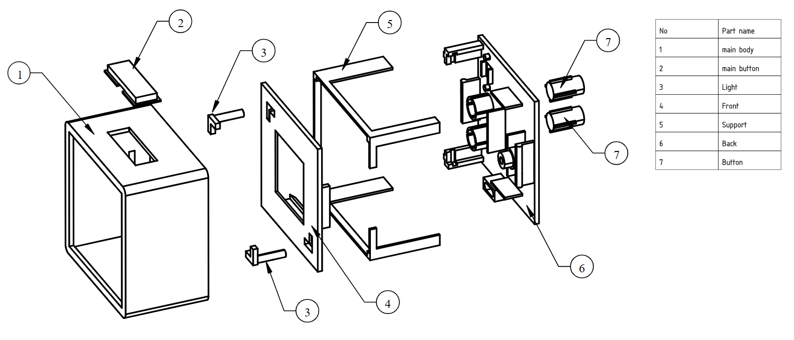

# Device case

The device case has been designed in FreeCad. The project file is stored in `Hardware/case/project` directory.
All case part models in .stl format can be found in `Hardware/case/models` directory.

## Device case scheme

