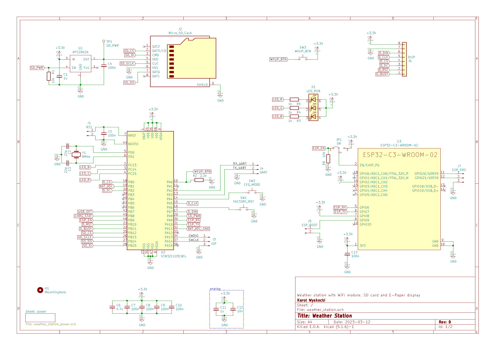
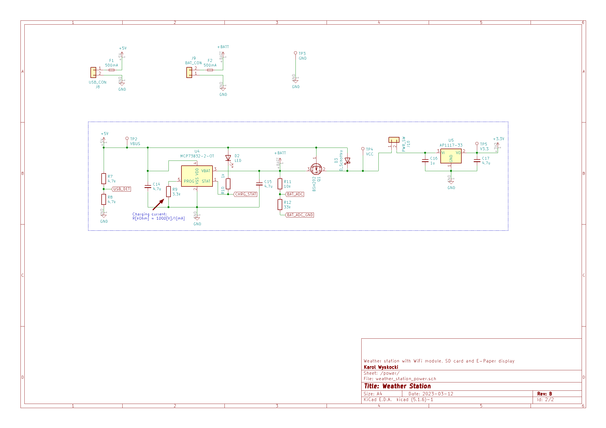
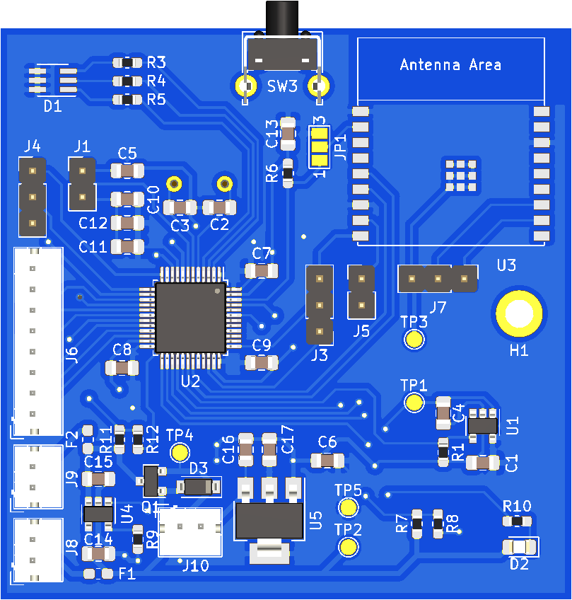
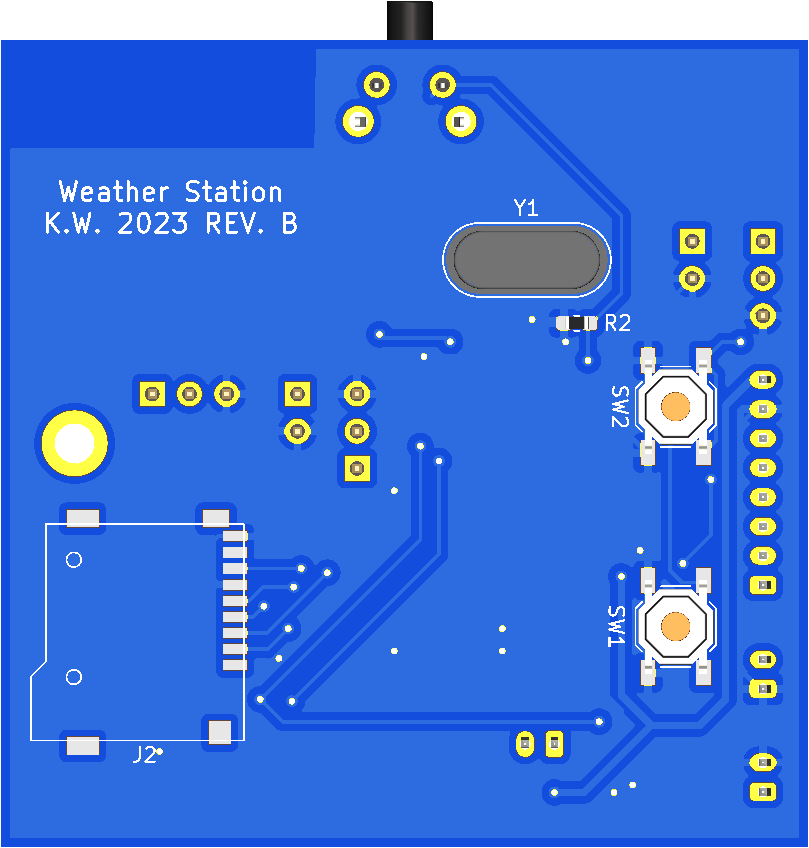

# Hardware

The scheme and PCB layout have been designed in KiCad. The project can be found in weather_station.zip archive.

## Jumpers and connectors
| J# | Description |
|--|--|
| J1 | MCU reset |
| J3 | MCU ISP: 1 - SWDIO, 2 - SWCLK, 3 - GND |
| J4 | MCU UART: 1 - RX, 2 - TX, 3 - GND |
| J5 | WiFi module boot mode: on - download mode. off - normal mode |
| J6 | E-Paper display |
| J7 | WiFi module UART: 1 - RXD, 2 - TXD, 3 - GND  |
| J8 | USB power line |
| J9 | Battery |
| J10 | Power switch |
| JP1 | WiFi module enable signal source: 1-2: MCU, 2-3: module always enabled |

## Electrical schematic

## PCB view:
| PCB top | PCB bottom |
|--|--|
|  |  |