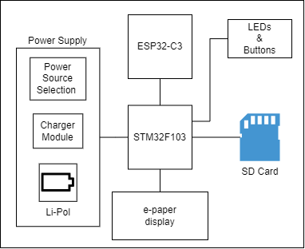
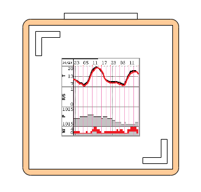
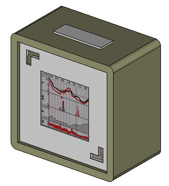

# weather-station-wifi
 **Useful links:**
 - [User Manual](Docs/user_manual.md)
 - [Electronics project](Hardware/electronics/README.md)
 - [Device case project](Hardware/case/README.md)
 - [Local development server](html/README.md)
 - [Web Server API](Docs/http_api_docs.md)
 - [Generation of display images](res/README.md)
 - [Preparation for first start](Docs/preparation.md)

## General description
This is a project of a weather station with WiFi module. The presented forecasts come from the [open-meteo](https://open-meteo.com/) service.

The device is based on the **STM32F103CBT6** microcontroller and the popular WiFi module: **ESP32-C3-WROOM-02**. The WiFi module works in the AT commands mode. The project uses a 1.54" 3-color [e-Paper display](https://www.waveshare.com/1.54inch-e-paper-module-b.htm) with a resolution of 200x200 px.

Block diagram of the device:

There are two main parts of the firmware: **forecast client** and **http server**.

The task of the forecast client is to decode the postcode to the coordinates (if the coordinates are not provided directly), download the weather forecast for the given coordinates and display it on the e-paper display.

The HTTP server is used in configuration mode. In the configuration mode, the WiFi module starts its own AccessPoint, and the HTTP server provides the configuration website.

## Device visualization:
| Front of the device | 3D view of the device |
|--|--|
|  |  |